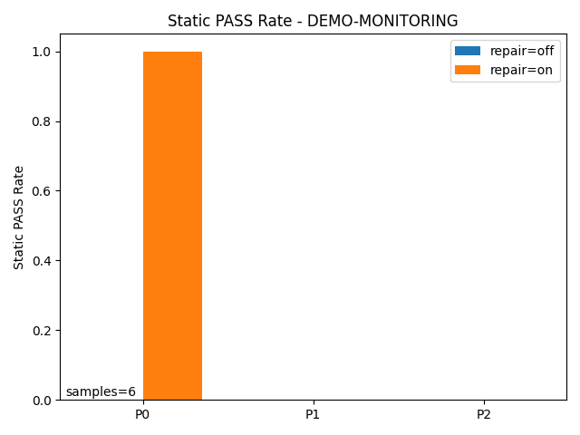
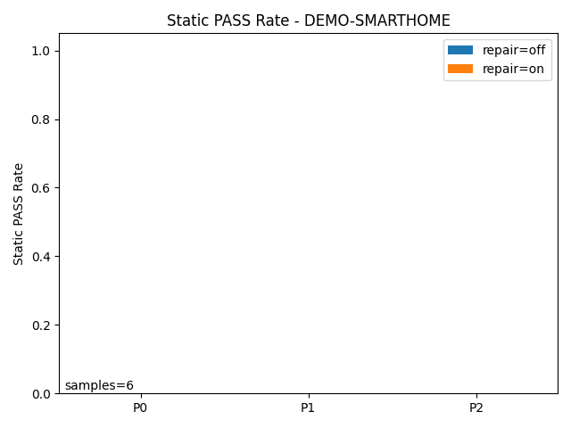
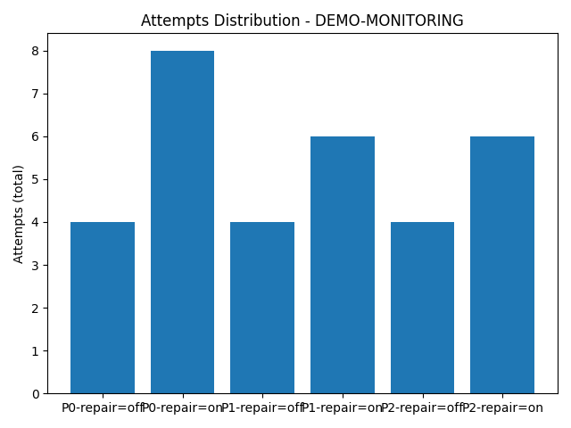
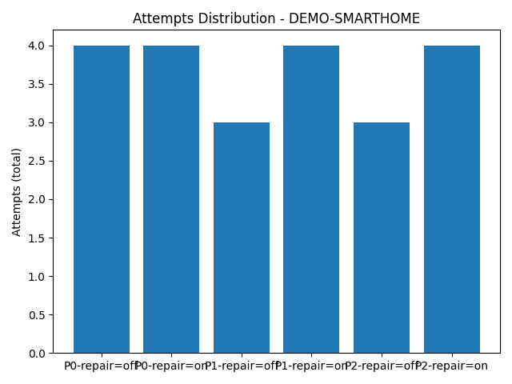
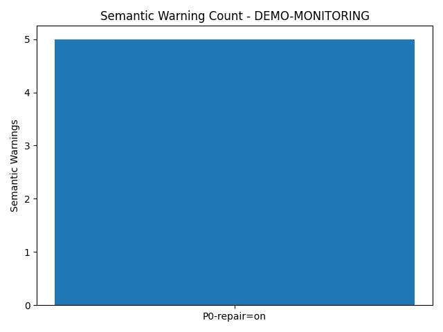
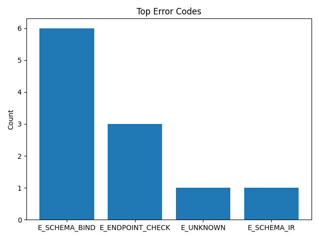
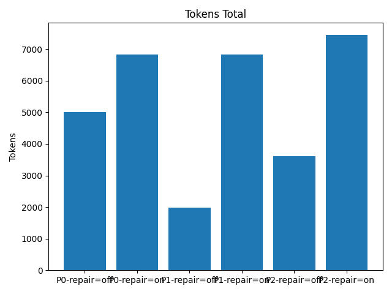
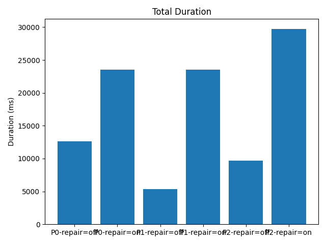

# Weekly Figures

## Fig1 Static PASS Rate

- Static PASS 口径；bar=repair on/off；x=prompt_tier（每 case 各一张）

## Fig2 Attempts Distribution

- attempts_total 分布；样本少则均值柱状

## Fig3 Semantic Warning Count

- 仅统计 static PASS 的语义警告数（warnings-only）

## Fig4 Error Distribution

- TopK error codes（count），无 summary_by_error 时从 FAIL runs 的 error_code_top1 统计

## Fig5 Cost (tokens/time)

- tokens_total/total_duration_ms 分布（缺列则跳过）

## Summary (mean by prompt_tier x repair)
### pass_rate_static
repair_flag  off   on
prompt_tier          
P0           0.0  0.5
P1           0.0  0.0
P2           0.0  0.0

### attempts_mean
repair_flag  off   on
prompt_tier          
P0           4.0  6.0
P1           3.5  5.0
P2           3.5  5.0

### tokens_mean
repair_flag     off      on
prompt_tier                
P0           5003.5  6819.0
P1           1991.0  6821.0
P2           3613.5  7457.0

### semantic_warnings_mean
repair_flag  off   on
prompt_tier          
P0           0.0  2.5
P1           0.0  0.0
P2           0.0  0.0
